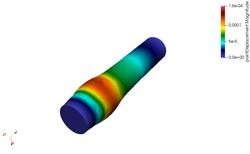

## Setup

The expanding tube test case involves a cylindrical fluid domain surrounded by a solid domain. A pressure inlet boundary condition is applied at the inlet for 3 milliseconds, and then 0 set to zero for a further 7 millisecond. The pressure of the fluid expands the tube which then relaxes once the pressure decreases.

The expanding tube test case comes with the interface surface mesh connectivity of the solid domain. This allows the use of nearest-projection mapping of the displacements of the solid domain. In order to run the example with nearest projection mapping, the "node-mesh-with-connectivity" has been specified in the `solid-calculix/config.yml` file. More details can be found in the [CalculiX configuration description](adapter-calculix-config.html#nearest-projection-mapping).

## Available solvers

Fluid participant:

* OpenFOAM. This tutorial is known to work with OpenFOAM 4.1, 5.0, but it should also work with newer versions. The case files are prepared for the latest versions of OpenFOAM and use the solver `pimpleFoam`. In case you are using a previous OpenFOAM version you need to adjust the solver to `pimpleDyMFoam` in the `Fluid/system/controlDict` file. For more information, have a look at the [OpenFOAM adapter documentation](adapter-openfoam-overview.html).

Solid participant:

* CalculiX. This tutorial is known to work with CalculiX 2.15, but it should also work with newer versions. For more information, have a look at the [CalculiX adapter documentation](adapter-calculix-overview.html).

## Running the simulation

You can start the simulation by running the script `./run.sh` located in each participant directory. OpenFOAM can be executed in parallel by using an additional `run.sh -parallel` flag. The default setting uses 4 MPI ranks.

## Post-processing

You can visualize the results using paraView or `cgx`(for native CalculiX resul files), as usual. The total deformation is rather small. Multiplying the deformation by factor of 10 (warp by vector filter in paraView) and visualizing the fluid domain at `t=0.005s` looks as follows:


